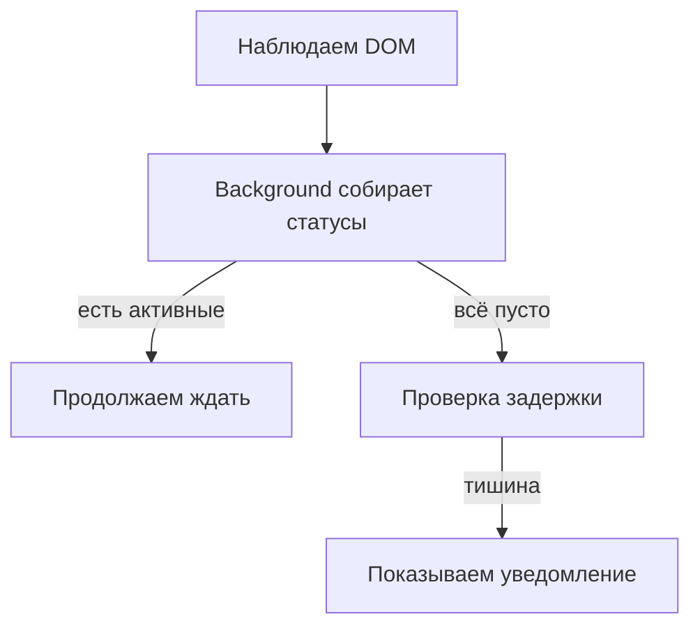
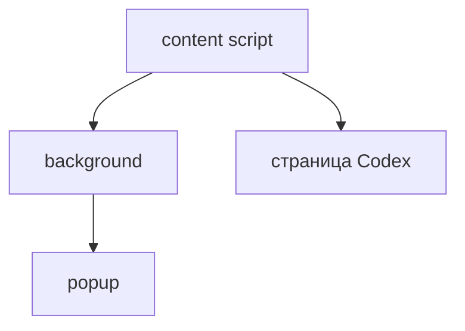
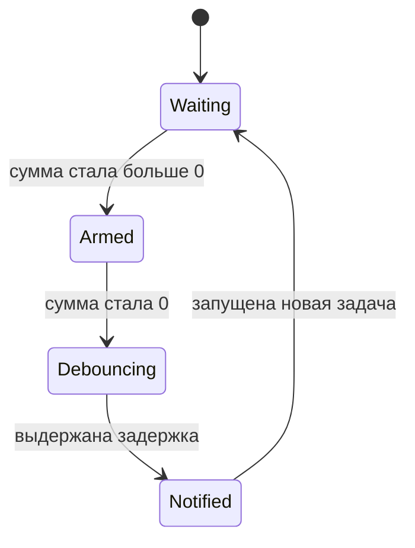
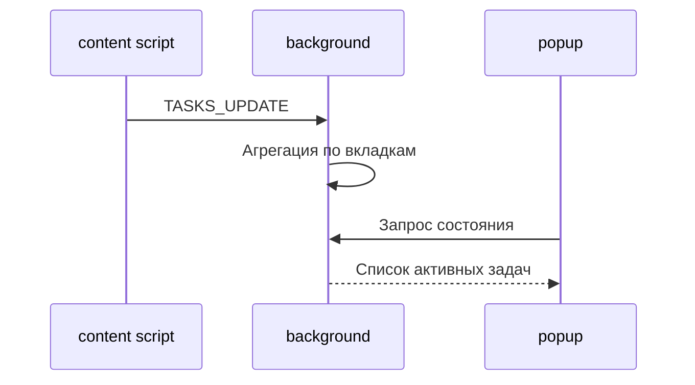
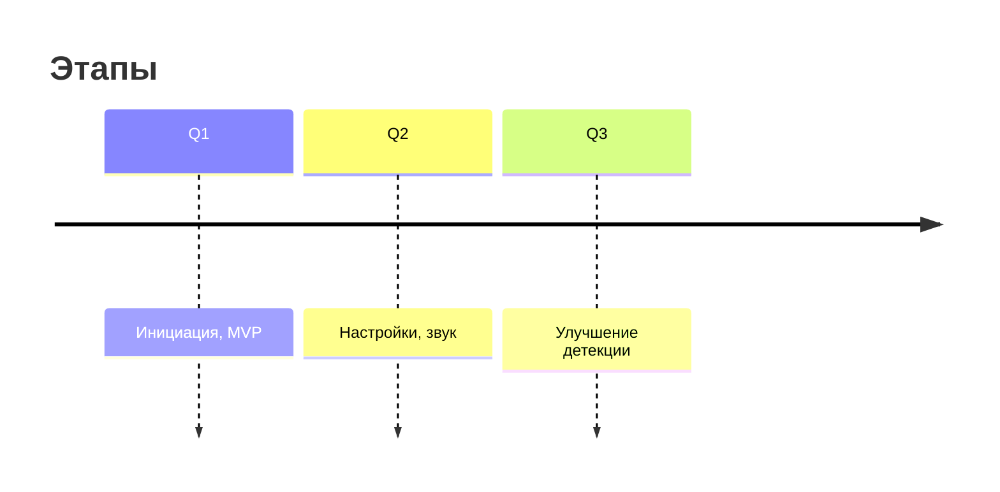

#  Tasks Watcher for Codex Cloud
       ПРОЕКТ НА ЭТАПЕ РАЗРАБОТКИ...
> CODEXEX - это лёгкое расширение Chrome для наблюдения за задачами в Codex Cloud в фоновом режиме. Смотрите ютубчик, читайте любимые сайты и ожидайте уведомлений о PR в ненавязчивом окошке как только все задачи будут решены. Порой кодекс автономно работает по 10-30 минут. Наблюдались лонгворкинги до 7 часов автономной работы. Будет полезно узнать что задача уже готова и поставить в очередь следующую.

<p align="center">
  
  
  
</p>

---

## Идея

Расширение следит за признаками выполнения задач в интерфейсе Codex и аккуратно сообщает, когда все задачи завершились. Никаких ключей, никакого доступа к приватным API — только наблюдение за DOM. Оно ставится за пару секунд, умеет параллельно держать несколько вкладок и молчит, пока все карточки не закрыты. Все события происходят локально, данные браузер не покидают.

---

## Скриншоты

Подойдёт пара кадров: компактный popup со списком активных задач и системное уведомление о полном завершении. Снимки можно положить в `/docs/img` и подключить сюда, когда будут готовы.

---

## Как это работает

* content‑script наблюдает DOM: ловит крутилки, кнопки Stop и другие признаки активности.
* background сводит сигналы со всех вкладок и решает, когда пора предупредить.
* popup просто показывает текущее состояние.

### Как это работает



---

## Быстрый старт

1. Склонировать репозиторий:

   ```bash
   git clone https://example.com/codex-tasks-watcher.git
   cd codex-tasks-watcher/extension
   ```
2. Открыть `chrome://extensions` → включить **Режим разработчика** → **Загрузить распакованное** и выбрать папку `extension`.
3. Открыть Codex и запустить задачу. Свернуть вкладку. Дождаться уведомления.

Структура каталога расширения минималистична: `manifest.json`, пара скриптов и html в `src`, иконки лежат в `assets`.

---

## Права и безопасность

Расширению нужны стандартные разрешения: `https://*.openai.com/*`, доступ к `storage`, `notifications`, `alarms`, `scripting` и, при необходимости, `tabs`, чтобы удерживать рабочие вкладки. Вся логика крутится на стороне браузера, наружу ничего не уходит, а рабочие данные живут в `chrome.storage.session`.

---

## Настройки

В MVP v0.1.0 пользовательских настроек нет: антидребезг (`debounceMs = 12000`) и защита от авто‑выгрузки вкладок (`autoDiscardableOff = true`) зашиты в коде background‑скрипта.

⚙️ В планах на v0.2.0 — вынести параметры в `chrome.storage.sync`, добавить простой UI в popup/options и опциональный звуковой сигнал. Хотим дать возможность настраивать `debounceMs`, переключать `autoDiscardable`, включать звук и бейдж со счётчиком.

---

## Диаграммы

### Компоненты



### Машина состояний уведомления



### Потоки данных



---

## Тесты вручную

Полезно пробежать по нескольким сценариям: одна вкладка (уведомление одно), две вкладки (сигнал только после опустошения обеих), мигающий спиннер (антидребезг гасит ложный сигнал) и свёрнутая вкладка (уведомление всё равно приходит).

---

## FAQ

**Работает ли в неактивной вкладке?** Да, если Chrome не выгрузил её из памяти.

**Что если Codex изменит верстку?** Детекторы перестроим, когда увидим изменения.

**Нужен ли интернет?** Нет, расширение не зовёт внешние сервисы.

---

## Роадмап

* v0.1: DOM‑детекторы, уведомление, popup, RU\EN
* v0.2: бейдж, настройки, звук
* v0.3: мягкий перехват fetch для повышения точности



---

## Лицензия

MIT © Автор проекта
