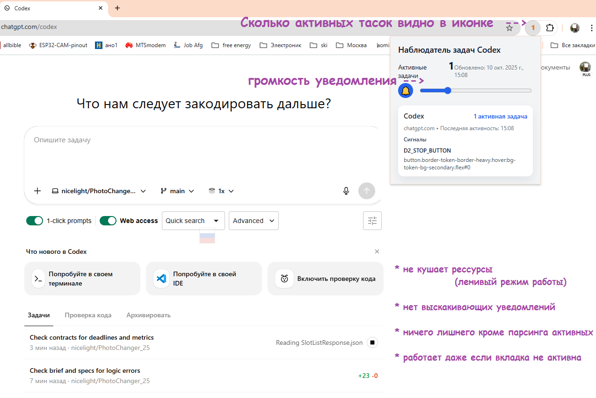
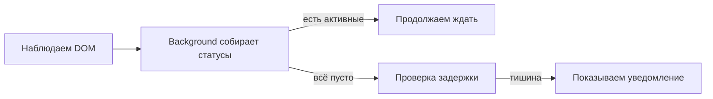
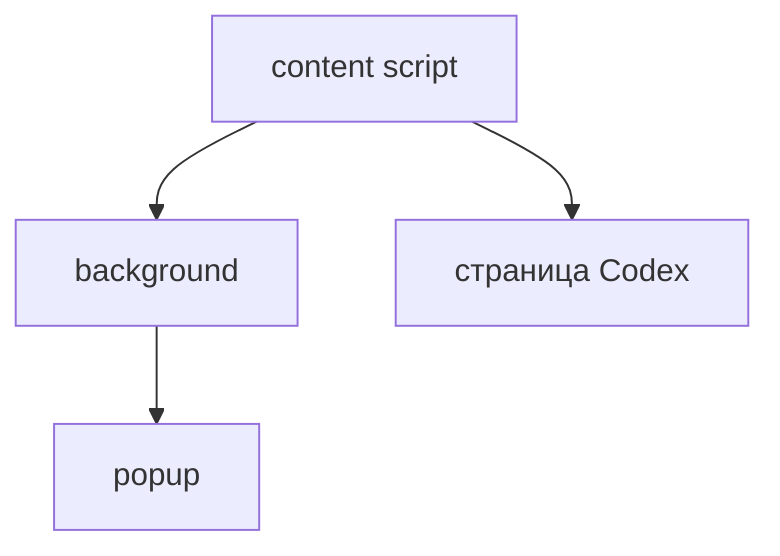
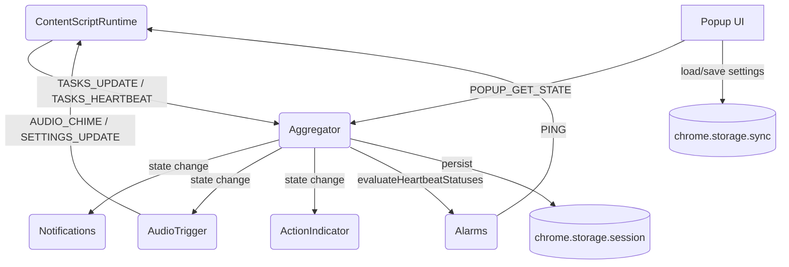
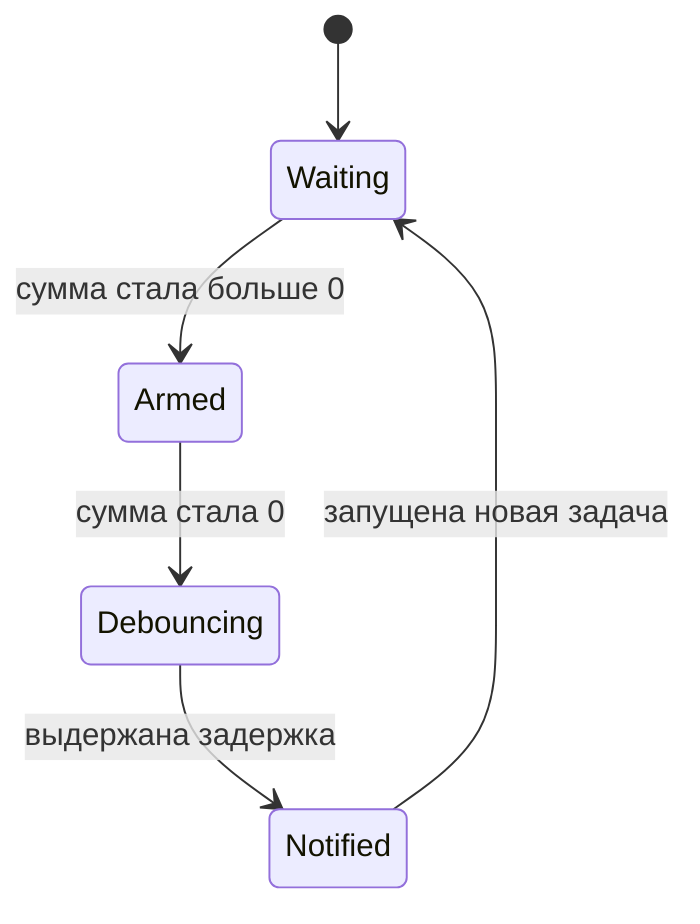
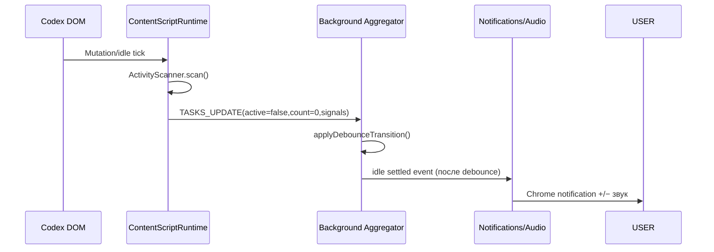
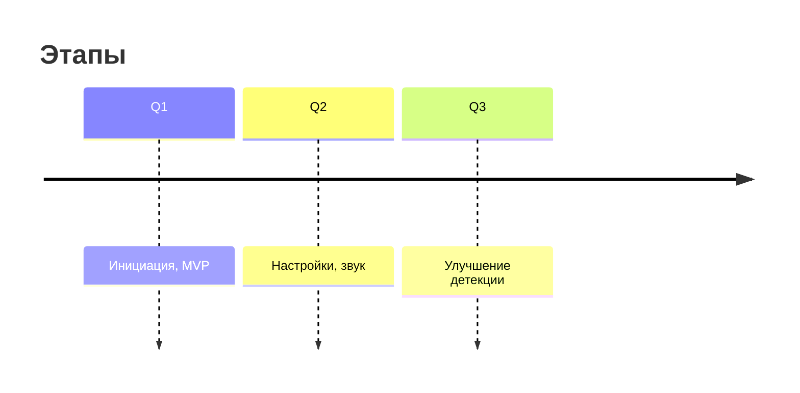

#  Codexex
> CODEXEX - это лёгкое расширение для **Codex Cloud** (for Chrome)

Порой кодекс автономно работает по 10-30 минут. Наблюдались лонгворкинги до 7 часов автономной работы.
 
Расширение показывает сколько тасок активно на данный момент. Можно воспроизвети тын-дын когда все таски выполнены. 


<p align="center">
  <a href="https://github.com/nicelight/Codexex/releases/tag/v0.1.1">
    
  </a>
  <a href="https://github.com/nicelight/Codexex/blob/main/dist/manifest.json">
    
  </a>
  <a href="./docs/PRIVACY.md">
    
  </a>
</p>


## Скриншот
 

---


## Как это работает

* content‑script наблюдает DOM: ловит крутилки, кнопки Stop и другие признаки активности.
* background сводит сигналы со всех вкладок и решает, когда пора предупредить.
* popup просто показывает текущее состояние.

### Как это работает



---

## Быстрый старт
### Либо скачать вручную
1. [Забираем архив из Релизов](https://github.com/nicelight/Codexex/releases/tag/v0.1.1)
2. Распаковываем и добавляем в расширения Хрома.
3. 
### Либо клон репозитория 
1. Склонировать репозиторий:

   ```bash
   git clone https://example.com/codex-tasks-watcher.git
   cd codex-tasks-watcher/extension
   ```
2. Открыть `chrome://extensions` → включить **Режим разработчика** → **Загрузить распакованное** и выбрать папку `extension`.
3. Открыть Codex и запустить задачу. Свернуть вкладку. Дождаться уведомления.

Структура каталога расширения минималистична: `manifest.json`, пара скриптов и html в `src`, иконки лежат в `assets`.

---

## Права и безопасность

Расширению нужны стандартные разрешения: `https://*.openai.com/*`, доступ к `storage`, `notifications`, `alarms`, `scripting` и, при необходимости, `tabs`, чтобы удерживать рабочие вкладки. Вся логика крутится на стороне браузера, наружу ничего не уходит, а рабочие данные живут в `chrome.storage.session`.

---

## Настройки

Фоновые сервисы читают настройки из `chrome.storage.sync` и применяют их без перезагрузки:

* `debounceMs` — длительность окна антидребезга (0–60000 мс, по умолчанию 12000).
* `autoDiscardableOff` — запрещает (`true`) или разрешает (`false`) авто‑выгрузку вкладок Codex.
* `sound` / `soundVolume` — включают аудио‑сигнал и управляют громкостью.
* `showBadgeCount` — резерв под бейдж иконки.

UI для изменения значений в разработке; до релиза можно задавать параметры вручную через DevTools (`chrome.storage.sync.set`).

---

## Диаграммы

### Компоненты


### Взаимодействие компонентов 


### Машина состояний уведомления



### Тригер завершенных задач


---

## Тесты вручную

Полезно пробежать по нескольким сценариям: одна вкладка (уведомление одно), две вкладки (сигнал только после опустошения обеих), мигающий спиннер (антидребезг гасит ложный сигнал) и свёрнутая вкладка (уведомление всё равно приходит).

---

## FAQ

**Работает ли в неактивной вкладке?** Да, если Chrome не выгрузил её из памяти.

**Что если Codex изменит верстку?** Детекторы перестроим, когда увидим изменения.

**Нужен ли интернет?** Нет, расширение не зовёт внешние сервисы.

---

## Роадмап

* v0.1: DOM‑детекторы, уведомление, popup, RU\EN
* v0.2: бейдж, настройки, звук
* v0.3: мягкий перехват fetch для повышения точности



---

## Лицензия

MIT © Автор проекта
