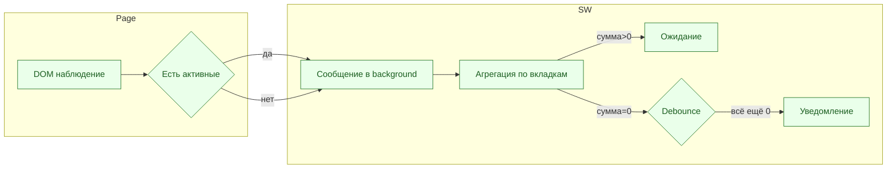
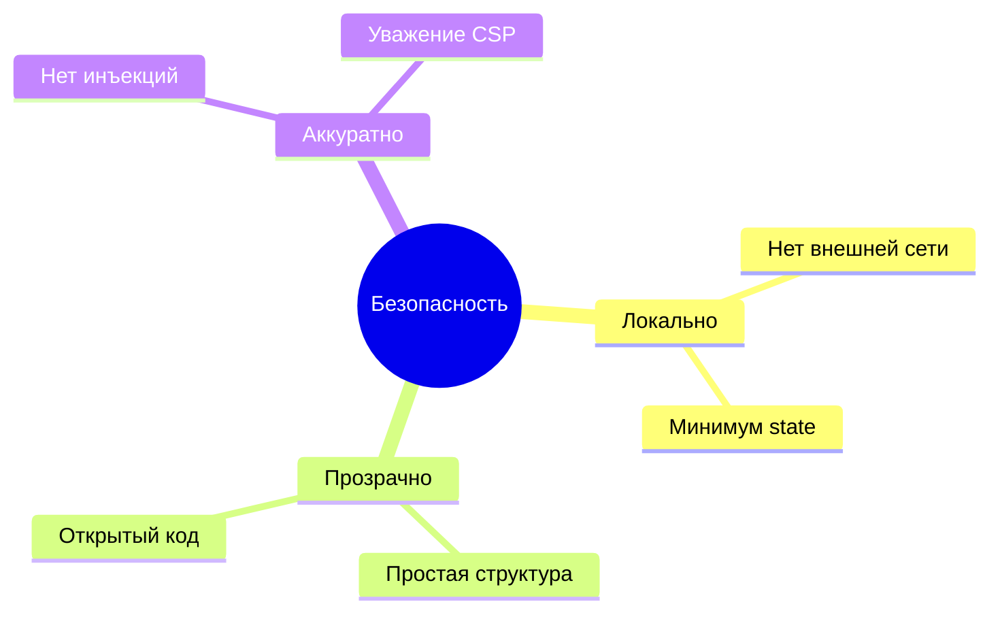
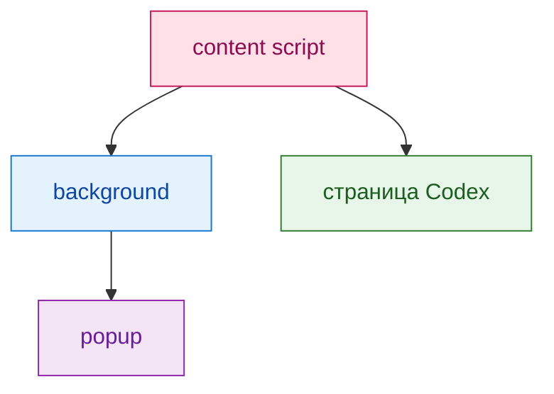
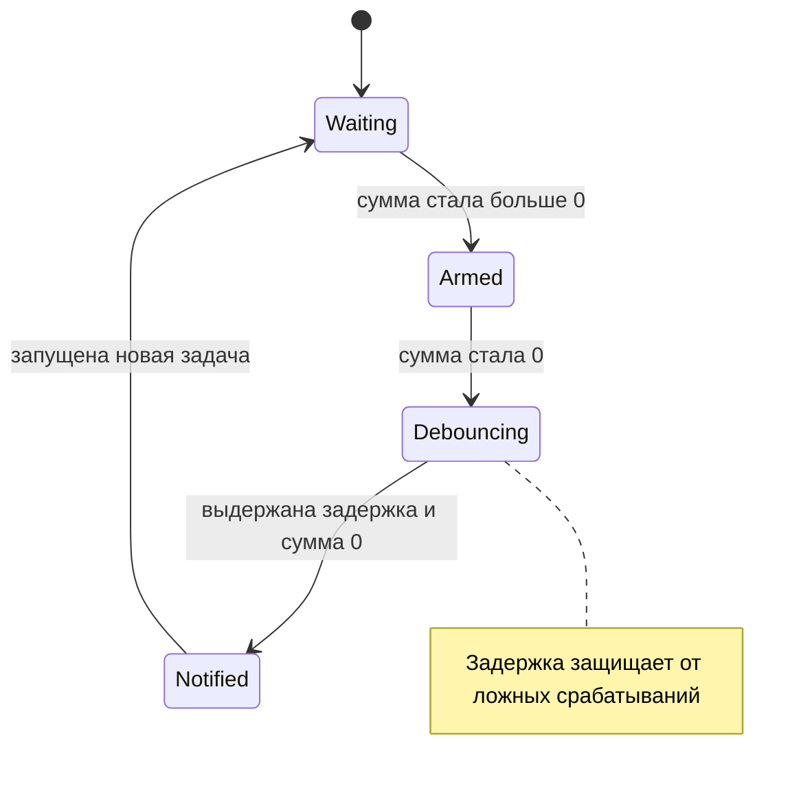
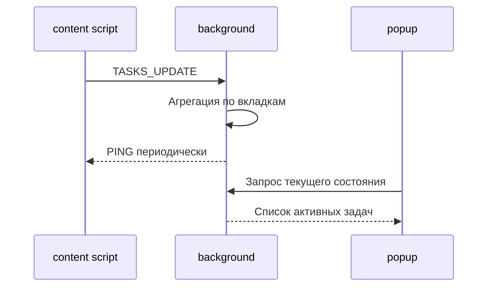
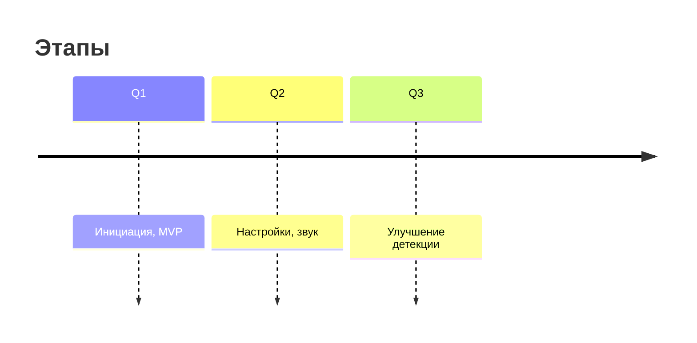

#  Tasks Watcher for Codex Cloud
       ПРОЕКТ НА ЭТАПЕ РАЗРАБОТКИ...
> CODEXEX - это лёгкое расширение Chrome для наблюдения за задачами в Codex Cloud в фоновом режиме. Смотрите ютубчик, читайте любимые сайты и ожидайте уведомлений о PR в ненавязчивом окошке как только все задачи будут решены. Порой кодекс автономно работает по 10-30 минут. Наблюдались лонгворкинги до 7 часов автономной работы. Будет полезно узнать что задача уже готова и поставить в очередь следующую.

<p align="center">
  
  
  
</p>

---

## Оглавление

* [Идея](#идея)
* [Скриншоты](#скриншоты)
* [Как это работает](#как-это-работает)
* [Быстрый старт](#быстрый-старт)
* [Права и безопасность](#права-и-безопасность)
* [Настройки](#настройки)
* [Диаграммы](#диаграммы)
* [Тесты вручную](#тесты-вручную)
* [FAQ](#faq)
* [Роадмап](#роадмап)
* [Лицензия](#лицензия)

---

## Идея

Расширение следит за признаками выполнения задач в интерфейсе Codex и аккуратно сообщает, когда все задачи завершились. Никаких ключей, никакого доступа к приватным API — только наблюдение за DOM.

**Ключевые плюсы**

* ⚡ Мгновенная установка и работа
* 🔕 Один сигнал при полном завершении
* 🧩 Работает во многих вкладках сразу
* 🔐 Данные не покидают браузер

---

## Скриншоты

> Примерные состояния интерфейса

* Popup: список активных задач или надпись «Нет активных»
* Системное уведомление: «Все задачи завершены»

*(Добавьте свои изображения в `/docs/img` и вставьте сюда)*

---

## Как это работает

* **content‑script** наблюдает DOM: ищет крутилки, кнопки Stop, эвристики карточек.
* **background** собирает статусы со всех вкладок и решает, когда показать уведомление.
* **popup** отображает актуальный список.

### Маленький набросок логики



> В диаграмме отсутствуют скобки, чтобы она отображалась корректно в Markdown‑рендерах Mermaid.

---

## Быстрый старт

1. Склонировать репозиторий:

   ```bash
   git clone https://example.com/codex-tasks-watcher.git
   cd codex-tasks-watcher/extension
   ```
2. Открыть `chrome://extensions` → включить **Режим разработчика** → **Загрузить распакованное** и выбрать папку `extension`.
3. Открыть Codex и запустить задачу. Свернуть вкладку. Дождаться уведомления.

**Структура**

```
/extension
  manifest.json
  /src
    bg.js
    content.js
    popup.html
    popup.js
    i18n.js
  /assets
    icon16.png icon48.png icon128.png
```

---

## Права и безопасность

* `host_permissions`: `https://*.openai.com/*`
* `permissions`: `storage`, `notifications`, `alarms`, `scripting` + опционально `tabs` для противодействия авто‑выгрузке вкладок.
* Данные не отправляются наружу. Храним минимум в `chrome.storage.session`.



---

## Настройки

В MVP v0.1.0 пользовательских настроек нет: антидребезг (`debounceMs = 12000`) и защита от авто‑выгрузки вкладок (`autoDiscardableOff = true`) зашиты в коде background‑скрипта.

> ⚙️ **План на v0.2.0** — вынести параметры в `chrome.storage.sync` с простым UI в popup/options и добавить необязательное звуковое уведомление.

| Ключ             | Тип     | Описание                              | Статус      |
| ---------------- | ------- | ------------------------------------- | ----------- |
| `debounceMs`     | number  | Задержка перед сигналом `>0 → 0`      | v0.2.0      |
| `autoDiscardableOff` | boolean | Управление `autoDiscardable` вкладок Codex | v0.2.0      |
| `sound`          | boolean | Короткий звук уведомления             | v0.2.0      |
| `showBadgeCount` | boolean | Бейдж с числом активных задач         | v0.2.0      |

---

## Диаграммы

### Компоненты



### Машина состояний уведомления



### Потоки данных



---

## Тесты вручную

* Одна вкладка: дождаться завершения → одно уведомление.
* Две вкладки: уведомление только когда обе пусты.
* Мигающий спиннер: уведомления нет из‑за задержки.
* Свернутая вкладка: уведомление приходит.

```mermaid
gantt
  title Мини сценарии
  dateFormat  X
  section Вкладка 1
  Задача        :a1, 0, 6
  section Вкладка 2
  Задача        :a2, 0, 4
  section Итог
  Уведомление   :milestone, a2, 0
```

---

## FAQ

**Работает ли в неактивной вкладке?** Да, если Chrome не выгрузил её из памяти.

**Что если Codex изменит верстку?** В коде несколько детекторов. При серьёзном редизайне обновим сигнатуры.

**Нужен ли интернет?** Нет, расширение не зовёт внешние сервисы.

---

## Роадмап

* v0.1: DOM‑детекторы, уведомление, popup, RU\EN
* v0.2: бейдж, настройки, звук
* v0.3: мягкий перехват fetch для повышения точности



---

## Лицензия

MIT © Автор проекта
