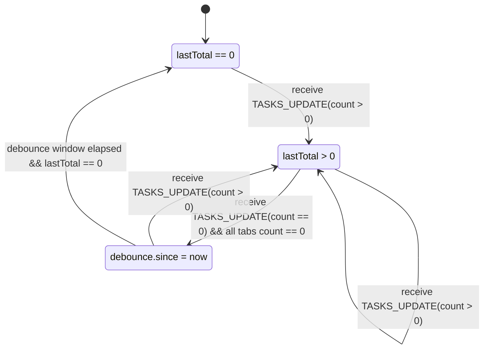

# Диаграмма состояний: lastTotal и антидребезг

```mermaid
stateDiagram-v2
    [*] --> Idle
    Idle: lastTotal == 0
    Idle --> Active: receive TASKS_UPDATE(count > 0)
    Active: lastTotal > 0
    Active --> Active: receive TASKS_UPDATE(count > 0)
    Active --> DebouncePending: receive TASKS_UPDATE(count == 0) && all tabs count == 0
    DebouncePending: debounce.since = now
    DebouncePending --> Active: receive TASKS_UPDATE(count > 0)
    DebouncePending --> Idle: debounce window elapsed && lastTotal == 0
```
