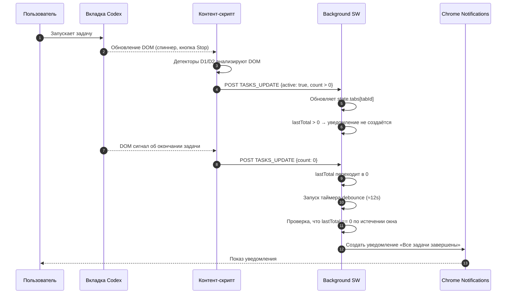

# Диаграмма последовательности: Обнаружение и уведомление

```mermaid
sequenceDiagram
    autonumber
    participant User as Пользователь
    participant Tab as Вкладка Codex
    participant CS as Контент-скрипт
    participant BG as Background SW
    participant Notif as Chrome Notifications

    User->>Tab: Запускает задачу
    Tab-->>CS: Обновление DOM (спиннер, кнопка Stop)
    CS->>CS: Детекторы D1/D2 анализируют DOM
    CS->>BG: POST TASKS_UPDATE {active: true, count > 0}
    BG->>BG: Обновляет state.tabs[tabId]
    BG->>BG: lastTotal > 0 → уведомление не создаётся
    Tab-->>CS: DOM сигнал об окончании задачи
    CS->>BG: POST TASKS_UPDATE {count: 0}
    BG->>BG: lastTotal переходит в 0
    BG->>BG: Запуск таймера debounce (≈12s)
    BG->>BG: Проверка, что lastTotal == 0 по истечении окна
    BG->>Notif: Создать уведомление «Все задачи завершены»
    Notif-->>User: Показ уведомления
```
